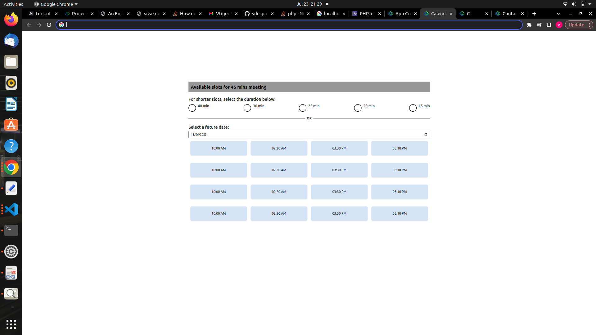

# Calendar-clone-single-page-

<h1>A simple Calendar Clone</h1>

A very simple and a basic calendar that i did using Vue JS components and HTML, CSS

I used media queries so that the page fits into every screen size

Here is the sample image for your reference

<em>Happy coding!</em>
Preview</img>
